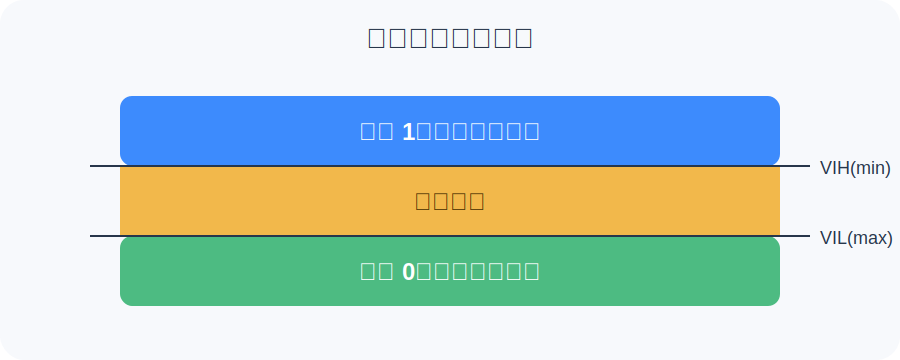

# 模电
## 1. 电容基础
### 定义
- 给定电位差下自由电荷的存储量, 记为C, 国际单位拉法F; 
- 一般来说, 电荷在电场中会受力而移动, 当导体之间有了介质, 则阻碍了电荷移动而使得电荷累积在导体上, 造成电荷的储存, 储存的电荷量称为电容;
### 构成: 
- 导体-绝缘体-导体构成的存储电荷的容器, 通电时两侧导体分别存储正负电荷, 在绝缘体两侧形成电场, 电场就是电容储存的能量形式;
### 公式
- 电容器所带电量Q与两极间的电压U的比值, 称为电容器的电容; 在电路学中, 给定电势差, 电容器存储电荷的能力, 叫做电容;
- 定义式: C = Q/U
- 决定式: C=εS/d=εrS/4πkd 其中εr时相对介电常数, S为电容极板正对面积, d为电容极板之间的距离, k是静电力常量; 
- 个人理解: 就平行板公式来说, 导体面积越大, 能存的电荷越多, 导体距离越近, 吸引力就越强, 符合直觉;
- 阻抗公式: XC = 1/(2π * f * C); 其中f为频率, C为电容大小, 频率越高阻抗越低, 因此电容适合作为高通滤波器;
### 作用
1. 储能: 有电时存电, 没电时放电;
2. 旁路: 电容"通交阻直", 面对高频信号时阻抗较低, 因此可以在电路中将高频噪声短路至地, 起到消除噪声的作用;
3. 滤波: 缓解电压尖峰/低谷时带来的影响, 尖峰时存储一部分电力, 低谷时释放一部分电力, 使整个电路上的电压更加平稳;
4. 去耦: 当芯片在某个瞬间需要大量电力的时候, 只透过电源供电可能来不及供电, 此时可以使用电容来提供一部分电力, 起到将芯片与电源解耦的作用;
### 单位
- 1法拉(F) = 10^3^毫法(mF) = 10^6^微法(µF) = 10^9^纳法(nF) = 10^12^皮法(pF)
- 三次方进位
### 实战
- 耐压一般选择比电路工作电压高, 因为:
    1. 电源尖峰时放出的电压往往比工作电压要高, 所以要留出一些缓冲
    2. 陶瓷电容特性: 加在两端的直流电压越接近耐压值, 实际容量越小
---
## 2.RC滤波原理
### 滤波器
- 过滤掉高频/低频讯号的器件
### RC低通/高通
- R: 电阻; C: 电容;
- 区别在于接线方式: 
    1. 低通: 电阻接在线上, 电容接地;
    2. 高通: 电容接在线上, 电阻接地;
> ***为什么要接电阻?***
- 原理: 电容面对高频信号阻抗低, 低频/直流阻抗高;
- 截止频率: fc = 1/(2π * R * C); 滤波器明显起作用的频率;
- 什么时候用: 小信号去噪, 不适用于电源(压降+发热); 电源用LC(磁珠+电容);
---
## 3.阻抗计算
### 阻抗
- 与电阻不同, 阻抗会随着电流频率的变化而变化, 如前面讲的电容阻抗会随着电流频率变大而变小, 电感则相反;
- 公式: 
    1. 电容阻抗: XC = 1/(2π * f * C); 其中f为频率, C为电容量
    2. 电感阻抗: XL = 2π * f * L; L为电感量;
- 低通用电感(磁珠), 高通用电容;
- 电容的寄生电感在极高频时会反客为主使电容滤波失效; 
---
## 4.噪声基础
### 噪声
- 噪声就是不被需要的信号;
### 噪声来源
- 内部来源: 
    1. 数字电路开关噪声
    2. 时钟源
    3. DCDC纹波
- 外部来源: 
    1. 充电器/快充
    2. 射频
    3. ESD静电
- 物理本质: 
    1. 地弹(地噪声)
    2. 串扰
### 特质
- 对模拟电路干扰更大, 且数字电路为模拟电路噪声来源, 模拟电路对电压变化极为敏感;
### 应对方法
- 源头减少:
    1. 数字IC选低噪声低功耗的型号
    2. DCDC选低纹波的型号
- 阻断噪声: 
    1. 数模分开供电(VDD, VDDA)
    2. 数模分地(VSS, VSSA)
- 过滤噪声:
    1. 滤波器
    2. 去耦电容
    3. RC/LC
- 提高抗干扰能力
---
## 5.寄生参数
### 定义
- 本来不想要, 但因为某些物理特性而不得不出现的东西
### 寄生电容(几十pF)
- 主要由于导体互相靠近, 不同金属层交叠或存在介质而产生, 如半导体内部或PCB走线之间; 容抗公式: XC = 1(2π * f * C); 高频下会导致信号流失, 使高频信号衰减;
### 寄生电感
- 只要闭合回路上的电流产生变化就一定会产生电感, 多由引线及PCB走线引起; 感抗公式: XL = 2π * f * L; 在高频或开关速度极快的电路中会产生严重的电压尖峰(振铃效应), 可能击穿器件或导致逻辑错误;
### 寄生电阻
- 万物皆有电阻, 由导线的物理材质以及长度决定; 会引起额外的压降和发热损耗功率; 电阻公式: R = ρ * (L/A); 其中ρ为电阻率, 取决于材质; L为导线长度; A为导线横截面积;
---
# 数电
## 1.GPIO(General Purpose Input/Output)
### 定义
- 通用输入输出引脚, MCU上可以自由配置功能的引脚
- 每个GPIO可以配置成多种模式
1. 输入模式
    1. 浮空输入: 不接上拉下拉, 引脚电平取决于外部
    2. 上拉输入: 引脚内部接上拉电阻到VDD(默认高电平)
    3. 下拉输入: 引脚内部接下拉电阻到GND
    4. 模拟输入: 给ADC用, 不做数字判断
2. 输出模式
    1. 推挽输出: 既能输出高也能拉低, 驱动能力强
    2. 开漏输出: 只能拉低, 高电平靠外部上拉(I2C必备)
3. 复用模式
    - 将引脚分配给其他外设, 在学习MUX时接触过
---
## 2.电平标准
### 定义
- 什么电压算作1, 什么电压算作0;
### 关键参数
1. VOH: 输出高电平时最低电压
2. VOL: 输出低电平时最高电压
3. VIH: 输入被认为是高电平时的最低电压
4. VIL: 输入被认为是低电平时的最高电压
- 输入多少V才被认为是1/0? 不低于多少V才算1, 不高于多少V才算0;
- 那么从VIH-VOH这中间的空白区算作"不确定"区, 无法判断是1还是0, 两者之间差距称为"噪声容限"

---
## 3.时序
### 定义
- 信号在时间轴上的波形规则——什么时候变化, 保持多久, 频率多高；
### 关键参数
1. 时钟频率
2. 建立时间
3. 保持时间
4. START/STOP条件
---
## 4.干扰抑制(见噪声基础)
---
# 器件
## 1.TP常用RC
---
## 2.ESD
### 定义
- Electrostatic Discharge, 静电放电
### 影响
1. 直接损坏: 芯片当场损坏, 引脚短路或开路
2. 潜在损坏: 内部已有微小损伤, 使用一段时间后才损坏
### 防护手段
1. TVS二极管
- 是一种特殊的二极管, 平时不工作, 当检测到电压超过设定值时立刻短路将电流接到GND;
    1. 正常信号(0~3.3V): TVS截止, 不影响信号
    2. ESD冲击(几千V): TVS接通, 将电流短路到GND;
    3. 芯片只看到正常信号
    4. 反应时间必须比ESD快
    5. 工作电压必须高于正常电压, 否则正常信号也会被导走
- 是一个高压时才会接通的元件
2. 放电环
3. RC滤波+电感隔离
- 滤波器也可以用在这里, 配合TVS形成多层防护
- 光靠滤波器一般挡不住
---
## 3.铁氧体(磁珠)
### 定义
- 本质是一个铁氧体包裹的电感, 会将高频能量转换为热量消散掉, 相比于普通电感更加稳定; 
### 电感
- 对直流电和低频电几乎没有阻力, 与电容相反;
- 电感反对电流的变化, 防止电流突变, 来拒去留(楞次定律)
- 感抗公式: XL = 2π * f * L, 对低频和直流电阻力较低, 对高频电阻抗较高;
---
## 4.导电线路
---
# 电源
## 1.LDO/DCDC纹波
### 前置
- 假设USB输入电压为5V, MCU使用电压为3.3V, 某通讯引脚工作电压为1.8V, 需要将输入的5V分别转换为3.3V和1.8V, 使用的装置为稳压器, 分为LCD和DCDC;
### LDO(Low Dropoutput Regulator)
- 线性稳压器, 本质是一个可调节电阻, 将多余的电压转换为热量消耗掉;
- 特点: 输出电压干净噪声小, 体积较小, 但效率低发热严重, 效率=调节后电压/调节前电压;
### DCDC(DC-DC Converter)
- 开关稳压器, 用开关+电感+电容将电压转换, 几乎不发热;
- 工作过程: 开关快速通断, 通的时候电源通过电感给电容和负载充电; 断的时候电感的惯性会继续给电容充电, 电容也放电; 透过控制通断比例来调节输出电压;
- 特点: 效率较高, 适合大电流大压差, 输出有纹波, 电路复杂体积大, 产生EMI干扰;
### 纹波
- 直流电压上叠加的周期波动; DCDC每次开关的动作都会输出叠加一个小波动;
- DCDC后接LDO, DCDC负责降压, LCD负责消除纹波, 高端电路使用;
## 2.压降
### 定义
- 电流流过导线/元件后电压降低的现象;
- 任何导体都有电阻, 根据欧姆定律∆U = I*R, 电流越大或导体电阻越大, 压降越大;
### 影响
- 远端芯片电压不足
- 大电流瞬间凹陷
### 应对
- 走线加粗加短; 使用星型走线多点供电; 远端反馈(较高端)
---
## 3.电源噪声(见噪声基础)
---
