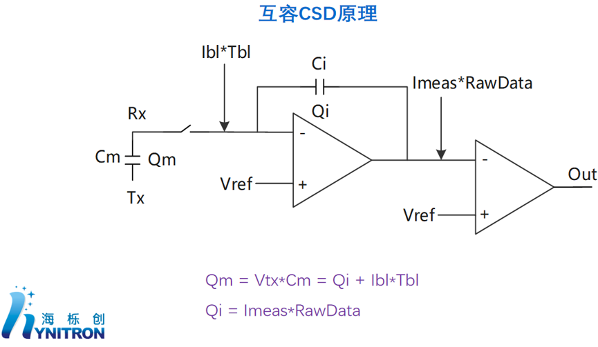

> 无论哪种扫描方式, 检测触摸的核心都是一个由横纵导线构成的矩阵
# 自容
## 原理
1. 自容模式下每根导线各自工作, IC会检测每根导线对地的寄生电容
2. 人体是一个巨大的导体, 而且对地有相当大的电容
3. 当手指按下时, 对导线来说相当于在原来对地有寄生电容的基础上又增加了手指-人体-大地这个电容, 从而使得总电容增加
4. 透过检测寄生电容的变化量可以判断是否有手指按下
5. IC拿到的信息是"哪几行哪几列出现电容变化"的行列投影信息
---
## 优点
- **灵敏度高, 信号强**: 手指带来的电容增量较大, 相对容易检测, 信噪比好;
- **支持带水/湿手触摸(相对而言)**: 水也是导体, 但手指造成的电容增量通常比一层水要明显, 所以在有水情况下仍可以准确检测到落点, 并非天生免疫水
- **成本较低, 结构简单**: 自容只需扫描M行+N列, 扫描次数为M+N
---
## 缺点
- **不支持多点**: 如同时按下(X1,Y1)与(X2,Y2)时, 芯片扫描发现X1, X2, Y1, Y2四根线的电容都变大了, 无法区分这四根线的四根交叉点哪个是真实的手指按下(X1,Y1)与(X2,Y2), 哪个是Ghost点(X1,Y2)与(X2,Y1)
- **抗噪声弱**: 自容检测的是每根导线对地的寄生电容, 噪声传进来时IC无法分辨电容变化量是手指按下引起的还是噪声引起的
---
# 互容
## 原理
1. 互容模式下横纵导线分工, 分为Tx发射极和Rx接收极
2. 向Tx中持续打入脉冲/方波(激励电压)从而使得Rx中产生等效的微小电流, 两者之间透过电场耦合, 隔着介质, 并非直接相连
3. 当有手指按下时, 会吸走一部分Tx发射出的电场线, 使得Rx中产生的电流变小
4. 透过检测电流变小的变化量来判断是否有手指按下
---
## 扫描
1. 互容检测的是每个Tx_i, Rx_j交叉点各自的耦合电容, 整块屏幕是M×N个独立交叉点
2. IC扫描后得到的是一张M×N的电容值表, 每个交叉点一个数, 称为RawData
3. 设备启动时会采集一帧干净的RawData作为基线数据base line, 之后还会按一套机制缓慢更新(防止温漂, 环境漂移等)
4. 手指按在哪个点上, 哪个点的数值就会发生改变
5. 将手指按下后的整张电容值表与未按下时的base矩阵相比可以得到diff矩阵(RawData - BaseLine)
6. 因为手指按下是有面积的, 一根手指会让相邻的几个点都发生变化
7. 透过重心算法可以算出手指按下面积的精确中心
---
## 优点
1. **支持多点触控**: 扫描出的是M×N交叉点矩阵, 每个点位置信息独立可知
2. **抗噪能力相对更强**: 检测的是Tx-Rx的相对耦合, 噪声同时作用在TxRx上, 相对变化量不变
---
## 缺点
1. **成本高**: 结构更复杂(M×N), 扫描次数更多
2. **信号相对弱**: 测的是耦合电容被手指削弱的一小部分
3. **隔玻璃/手套相对吃力**: 吸电场线能力弱
---
# RawData
## 定义
- 指每个交叉点测出来的还未经过任何处理的电容原始值, 即一张M×N的电容值表
---
# CSD扫描原理
## 流程
1. Tx加激励电压, 透过Tx-Rx之间耦合电容Cm, 在Rx上感应出电荷, 电荷的大小由Cm决定, 对应公式Qm = Vtx * Cm
2. Rx开关接通, 将Qm中的电荷送进测量电路中
3. Ibl为补偿电流, Tbl为补偿电流持续时间, 两者相乘得到补偿电荷
4. 因为手指按下带来的变化与Qm相比较小, 不易测量, 因此使用补偿电流将原本的大部分Qm抵消掉, 剩下的电荷进入积分电容Ci中, 称为Qi, 关键公式Qm = Qi + Ibl * Tbl
5. 无触摸时, Qi是一个稳定的基准值, 手指按下时吸走一部分Tx发射出的电场线, 导致Rx中的电荷量变少, 但补偿电荷大小不变, 导致Ci中电荷变少
6. Ci上积累了电荷就会产生电压, 即为积分器的输出电压
7. 想象Ci是个水杯, Qm是Cm中倒出的水, Ibl\*Tbl是恒定额度的抽水机, 当抽水机满了后剩下的水就流进Ci中, 即为输出电压
8. 想知道Ci精确装了多少水, 办法是用一把固定大小的勺子(Imeas), 一勺一勺地舀水, 数舀了几勺就能判断出总共有多少水; Imeas: 每勺大小, RawData: 舀的次数
9. Imeas一勺一勺搬电荷, 每个时钟周期 Imeas这个固定电流源从积分电容中搬走固定量的电荷, 每搬一次, Ci中电荷少一些, 积分器输出电压降一些, 计数器+1; 不停舀不停数, 直至积分器输出降到Vref; 最终计数值就是RawData; 电荷越多 → 要舀越多勺 → 计数越大 → RawData 越大。而电荷 Qi 正比于 Cm。所以绕一圈，RawData 最终反映的就是 Cm 的大小
10. 根据公式, 联立得: `RawData = (Vtx * Cm – Ibl * Tbl) / Imeas`;
注: 这条线性公式描述的是理想关系, 真实 Sigma-Delta 是多周期逐次逼近, 公式是它的等效结果

这张图和这套推导是单次积分加比较的简化模型，真实 Sigma-Delta 用多周期反复积分和反馈逼近来提升精度
